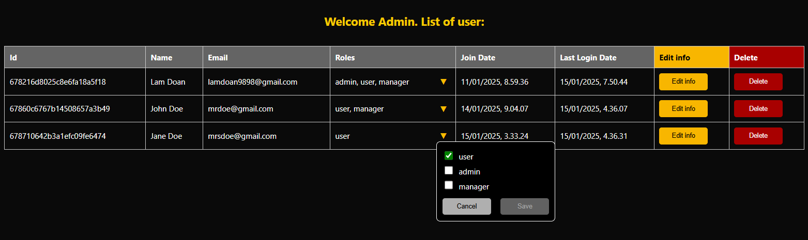
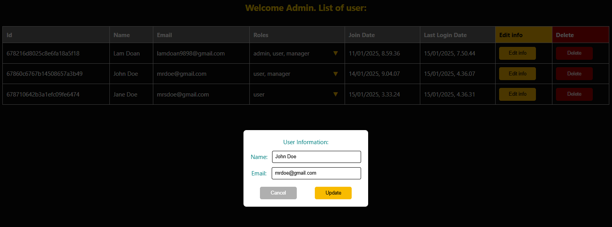
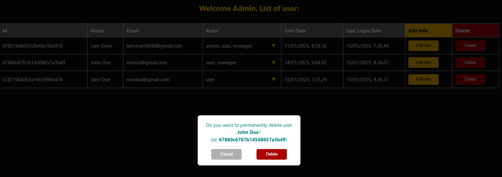
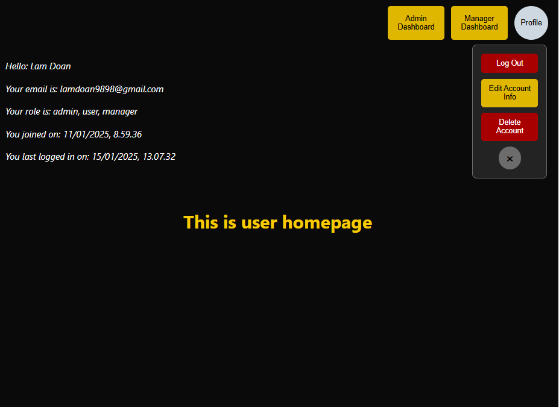
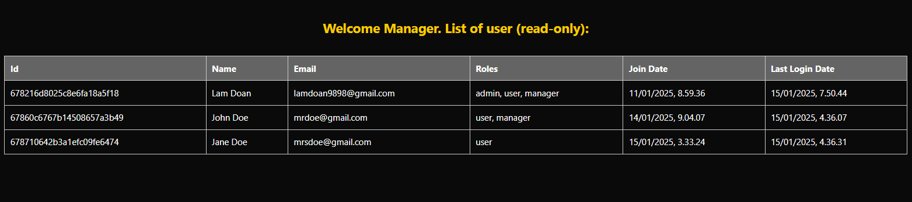
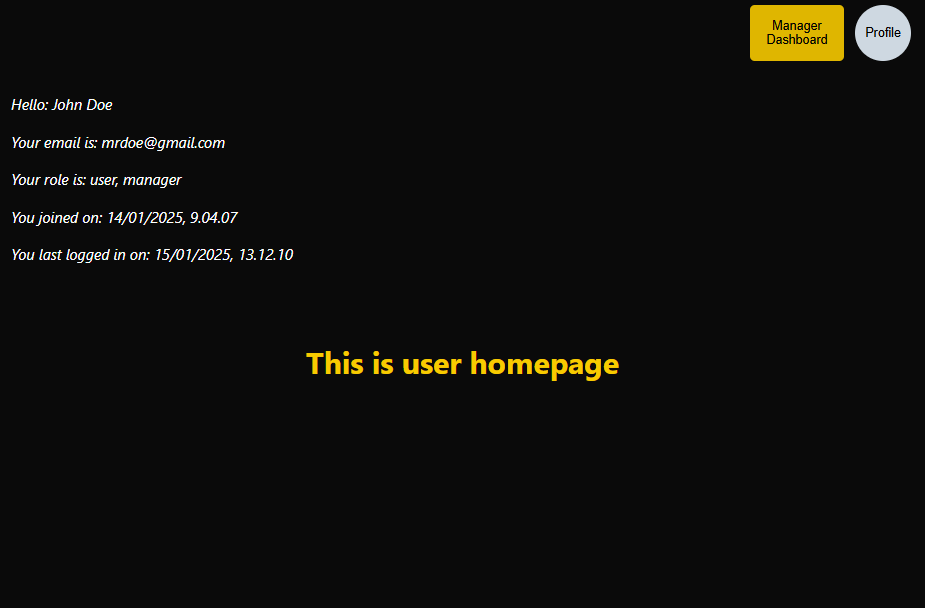
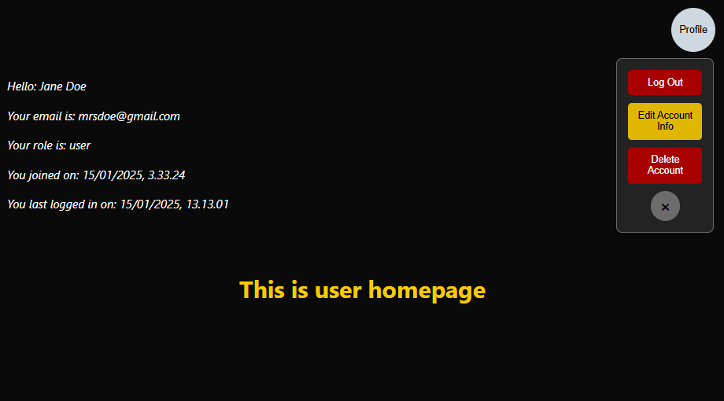
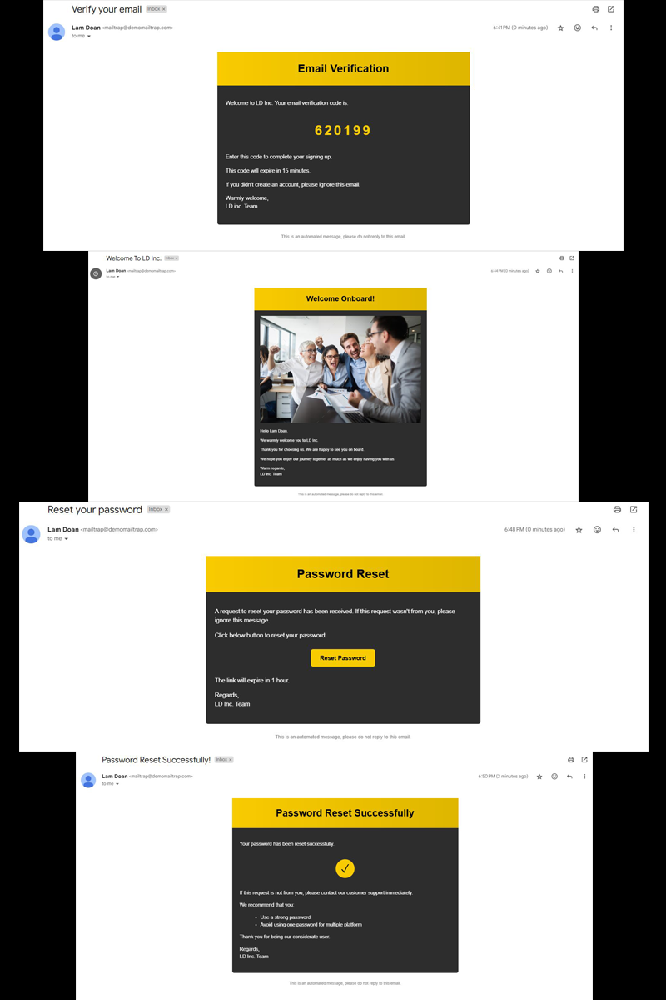

Translattion from [MERN Auth Model](https://github.com/liamdoan/MERN-auth-SPA) to PERN + Prisma ORM model

## Description

Full authentication module with React-Nodejs-Espress-MongoDB, redux and OAuth 2.0 protocol. (screenshot can be seen in this [integration](https://github.com/liamdoan/MERN-auth-SPA))

The focus is onto the infrastructure and file management, which aims to facilitate the `expanding` and `integration to other projects`.

`Authentication flow`

- After signup, the verification code is sent to user email.
- Providing correct code, user account will be verified, then directed to Login page.
- Clicking Forgot Password button and providing correct email, a link to reset password is sent to user email.
  Through that link, user can reset password. If everything works, an email to confirm password reset will be sent.
- User logs in, and is directed to Homepage which is a `protected route`. Specific view is allowed based on user's roles.
- With cookie, if session is still valid, user doesn't have to log in if browser is shut down or refreshed.
- If user session is still valid and user clicks login button from root home page, it directs user to `protected route` without stopping at login page.

`(currently tested ok with Mailtrap demo, and demo service only allows Mailtrap to send emails to user's own account email address - me)`.

`Role-Based Access Control (RBAC)`

- 3 roles "admin", "manager", "user"
- User by default is assigned to "user" role, can see basic view.
- Manager can see (read-only) user database.
- Admin can see, manipulate user database (edit, assign role, delete).

Frontend:

- TypeScript React, Redux.

Backend:

- NodeJS, Express, jwt (jsonwebtoken), bcryptjs and crypto library.

Database:

- MongoDB

Authorization protocol:

- OAuth 2.0

Further expansion: integrate with other MERN projects.

## Screenshot

- "admin" dashboard, admin can manipulate database:
  
  
  

- "Admin" homepage:
  

- "Manager" dashboard, read only:
  

- "Manager" homepage:
  

- "User" homepage:
  

- Email view:
  

- User Authentication flowview:
  
